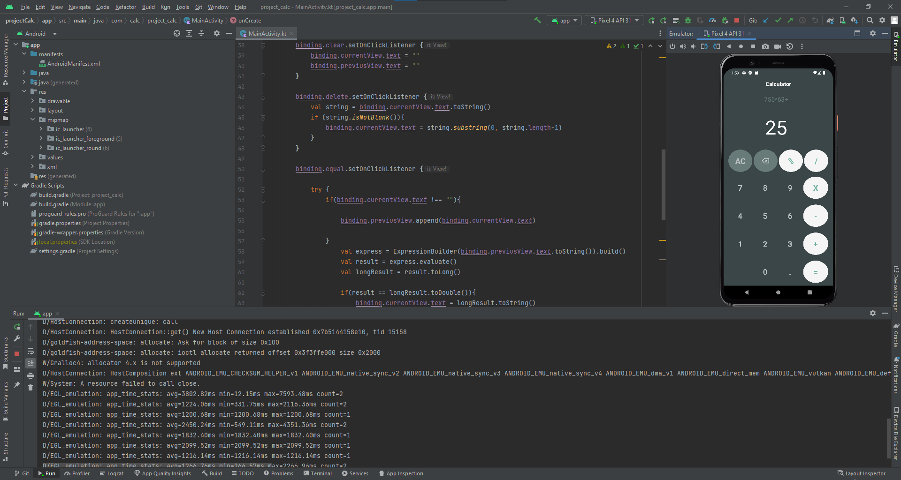

# project_calculator_app_kotlin
Um aplicativo Android Kotlin de Calculadora

O Projeto ainda não está como quero, preciso implementar as funções:

<ol>

<li>[ ] - Porcentagem </li>
[ ] - Add um ponto assim que completa 4 numeros seguidos sem virgula
[ ] - Som diferente nas teclas
[ ] - Tipografia
[ ] - Refatorar o codigo deixando-o mais simples 
</ol>

Obrigado!!!
